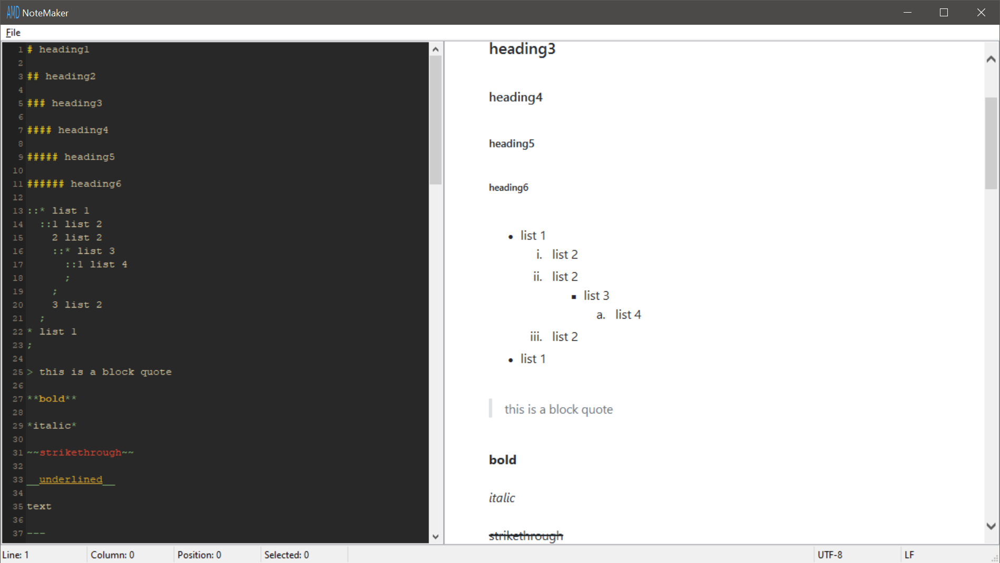
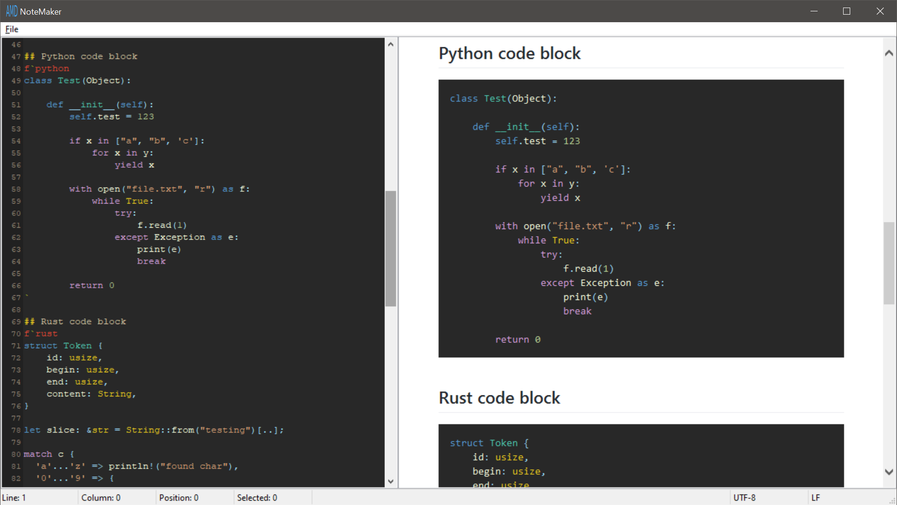

# NoteMaker

A program for making notes using a slightly altered version of the Markdown format. **Made for personal use, don't use it!**

It highlights your .amd(Almost Markdown) files using regular expressions, including code! Whenever you open or save a file a lexer written in Rust will tokenize the text and output the equivilent html and load that into a webview widget to be displayed.

A full showcase of the supported features can be seen by opening the test.amd file included with the program.
You can find a pre-built Windows binary on the [releases](https://github.com/AndrewGrim/NoteMaker/releases) page.

## Build
You need `Python 3.6` and `wxPython` for running the actual application. On linux you also need `libwebkitgtk-3.0-dev`.

For building the Rust lexer you will need a `Nightly` build of Rust that supportes `PyO3 v0.8.4`.

After you have that just run `make` if you're on Windows or `make release.linux` if you're on Linux.

    

    

