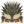

# heading1

## heading2

### heading3

#### heading4

##### heading5

###### heading6

* list 1
	* inner list 1
	* inner list 2

* list 2

> this is a block quote

**bold**

*italic*

`code`

- [ ] unchecked
- [x] checked

[this is a link](https://google.com)
